

  <h1 style="text-align: center;font-weight: bold">Laporan Praktikum
   Workshop Administrasi Jaringan</h1>
  <h4 style="text-align: center;">Dosen Pengampu : Dr. Ferry Astika Saputra, S.T., M.Sc.</h4>

 

  
  <h3 style="text-align: center;">Disusun Oleh : </h3>
  

    <strong>Nama: Fikri Athanabil Effendi</strong> 
    <strong>NRP: 3123500012 </strong> 
    <strong>Kelas: D3 IT A</strong>
  

<h3 style="text-align: center;line-height: 1.5">Politeknik Elektronika Negeri Surabaya Departemen Teknik Informatika Dan Komputer Program Studi Teknik Informatika 2023/2024</h3>
  

1. proses download image MySQL menggunakan Docker. Command docker pull mysql:latest sedang mengunduh berbagai layer yang diperlukan untuk menjalankan MySQL container. Status "Download complete" dan "Pulling fs layer" menunjukkan proses download sedang berlangsung.

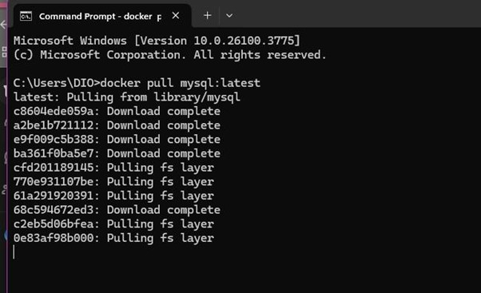

2. Terlihat command Docker yang panjang untuk menjalankan MySQL container dengan berbagai parameter konfigurasi, termasuk setting environment variables dan port mapping.

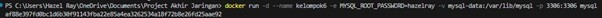

3.  Menampilkan status container yang sedang berjalan menggunakan docker ps. Container MySQL dengan ID "af68b297c690" sedang running dengan port mapping 3306:3306 dan nama "kelangsks".

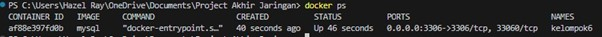

4. Command untuk masuk ke dalam MySQL container yang sedang berjalan menggunakan docker exec dengan parameter untuk akses MySQL client.

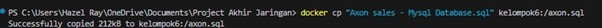

5. Menampilkan informasi koneksi MySQL setelah berhasil masuk dan copyright information dari Oracle.

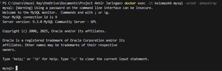

6. Eksekusi file SQL script (/axon.sql) yang menjalankan berbagai query. Terlihat beberapa "Query OK" dengan "0 rows affected" dan satu "1 row affected", menunjukkan script berhasil dijalankan.

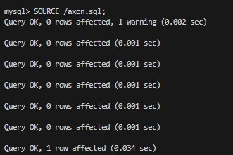

7. Output dari command SHOW DATABASES; yang menampilkan daftar database yang tersedia: classicmodels, information_schema, mysql, performance_schema, dan sys.

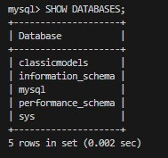

8. Setelah menggunakan database classicmodels, command SHOW TABLES; menampilkan 8 tabel yang ada: customers, employees, offices, orderdetails, orders, payments, productlines, dan products.

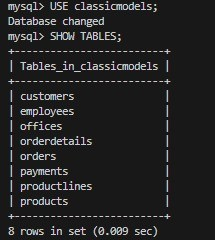

9. Menampilkan struktur salah satu tabel customers dengan detail kolom-kolomnya termasuk tipe data, constraints, dan informasi lainnya.

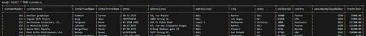

10. Interface GUI untuk membuat koneksi ke database MySQL dengan field Server dan Database yang kosong.

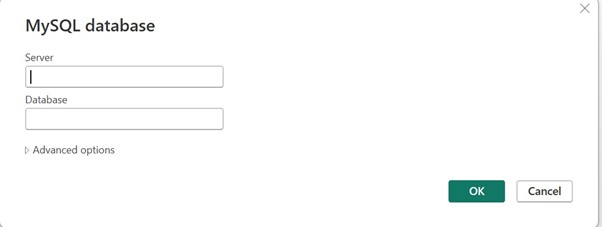

11. Panel navigasi yang menampilkan struktur database classicmodels dengan 8 tabel yang dapat diperluas. Ini adalah interface grafis untuk menjelajahi database.

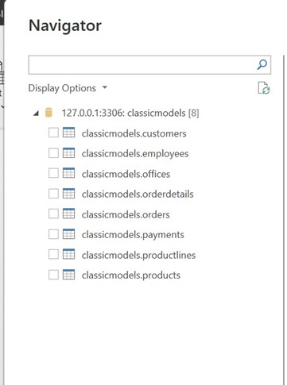

12. Dashboard analisis "AXON Classical Cars" yang dibuat di Power BI, menampilkan berbagai visualisasi data seperti:

- Total Sales: 9.60M
- Order Value: 3.83M
- Best Customer: 122
- Best Employee: 23
- Grafik donut untuk sales by year
- Bar chart dan pie chart untuk analisis pelanggan
- Panel visualisasi di sebelah kanan

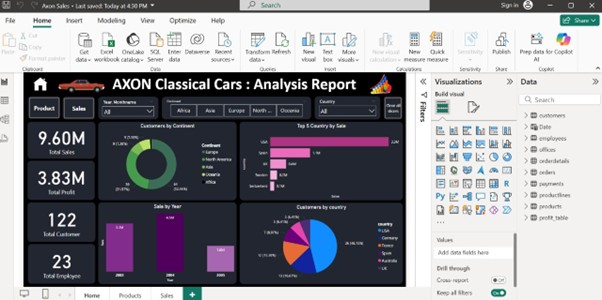
