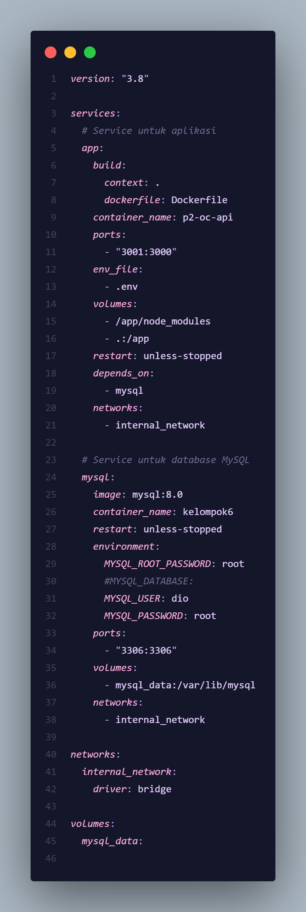
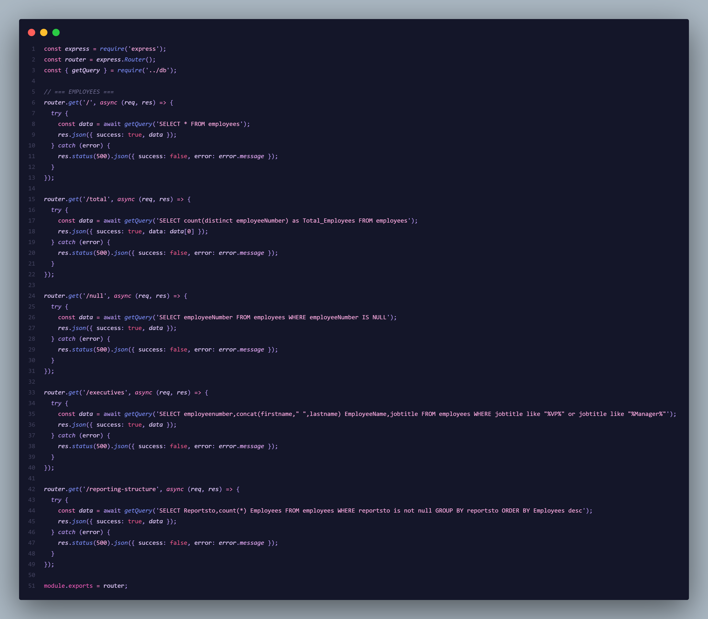
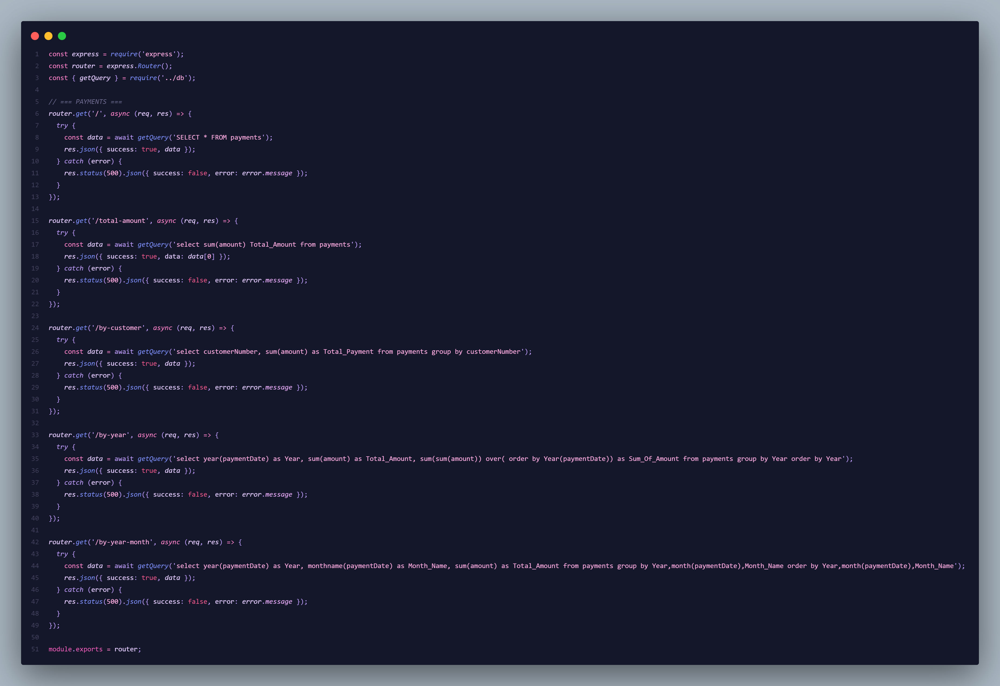

<div align="center">
  <h1 style="text-align: center;font-weight: bold">Laporan Praktikum
  <br>Workshop Administrasi Jaringan</h1>
  <h4 style="text-align: center;">Dosen Pengampu : Dr. Ferry Astika Saputra, S.T., M.Sc.</h4>
</div>
<br />
<div align="center">
  
  <h3 style="text-align: center;">Disusun Oleh : </h3>
  <p style="text-align: center;">
    <strong>Nama: Fikri Athanabil Effendi</strong><br>
    <strong>NRP: 3123500012 </strong><br>
    <strong>Kelas: D3 IT A</strong>
  </p>
<h3 style="text-align: center;line-height: 1.5">Politeknik Elektronika Negeri Surabaya<br>Departemen Teknik Informatika Dan Komputer<br>Program Studi Teknik Informatika<br>2023/2024</h3>
  <hr><hr>
</div>

## Deskripsi Proyek

Pada Week 14 ini, kami mengimplementasikan containerization menggunakan Docker untuk proyek backend API Kelompok 6. Proyek ini merupakan REST API yang dibangun dengan Node.js dan Express.js untuk menganalisis database ClassicModels dengan menggunakan MySQL sebagai database.

## Arsitektur Aplikasi

### Backend API

- **Framework**: Node.js dengan Express.js
- **Database**: MySQL (ClassicModels)
- **Port Aplikasi**: 3001 (mapping dari 3000 internal)
- **Port Database**: 3306

### Struktur API Endpoints

Aplikasi ini menyediakan 5 modul utama:

1. **Customers** (`/api/customers`)

   - `GET /` - Semua data pelanggan
   - `GET /total` - Total jumlah pelanggan

2. **Employees** (`/api/employees`)

   - `GET /` - Semua data karyawan
   - `GET /total` - Total jumlah karyawan
   - `GET /null` - Karyawan dengan employeeNumber NULL
   - `GET /executives` - Karyawan dengan posisi VP atau Manager
   - `GET /reporting-structure` - Struktur pelaporan karyawan

3. **Offices** (`/api/offices`)

   - `GET /` - Semua data kantor
   - `GET /total` - Total jumlah kantor
   - `GET /by-country` - Kantor berdasarkan negara

4. **Orders** (`/api/orders`)

   - `GET /` - Semua data pesanan
   - `GET /total` - Total jumlah pesanan
   - `GET /by-year-month` - Pesanan berdasarkan tahun dan bulan
   - `GET /shipped` - Pesanan yang sudah dikirim
   - `GET /shipped-by-year` - Pengiriman berdasarkan tahun

5. **Payments** (`/api/payments`)
   - `GET /` - Semua data pembayaran
   - `GET /total-amount` - Total jumlah pembayaran
   - `GET /by-customer` - Pembayaran berdasarkan pelanggan
   - `GET /by-year` - Pembayaran berdasarkan tahun
   - `GET /by-year-month` - Pembayaran berdasarkan tahun dan bulan

## Implementasi Docker

### Docker Compose Configuration

Proyek ini menggunakan Docker Compose untuk orchestrasi aplikasi dan database MySQL:



**Konfigurasi Docker Compose:**

- **Aplikasi**: Container `p2-oc-api` dengan port mapping 3001:3000
- **Database**: Container `kelompok6` dengan MySQL 8.0
- **Network**: `internal_network` untuk komunikasi antar container
- **Volume**: `mysql_data` untuk persistensi data database

### Dockerfile

Aplikasi menggunakan Node.js 18 Alpine sebagai base image untuk efisiensi ukuran container.

## Source Code Implementation

### Employee Routes

Implementasi endpoint untuk mengelola data karyawan:



Endpoint employees menyediakan berbagai query untuk analisis data karyawan termasuk:

- Pencarian karyawan dengan employeeNumber NULL
- Filter karyawan eksekutif (VP dan Manager)
- Struktur pelaporan organisasi

### Orders Routes

Implementasi endpoint untuk mengelola data pesanan:


Endpoint orders menyediakan analisis data pesanan berdasarkan:

- Status pengiriman
- Periode waktu (tahun dan bulan)
- Agregasi data pesanan

### Payments Routes

Implementasi endpoint untuk mengelola data pembayaran:



Endpoint payments menyediakan analisis finansial termasuk:

- Total pembayaran per pelanggan
- Analisis pembayaran berdasarkan periode
- Agregasi data finansial

## Command untuk Menjalankan Aplikasi

### 1. Persiapan Environment

```bash
# Clone atau navigasi ke direktori proyek
cd backend-kelompok6

# Pastikan file .env sudah dikonfigurasi dengan benar
# Contoh isi .env:
# DB_HOST=mysql
# DB_USER=dio
# DB_PASSWORD=root
# DB_NAME=classicmodels
# PORT=3000
```

### 2. Build dan Jalankan dengan Docker Compose

```bash
# Build dan jalankan semua container
docker-compose up --build

# Atau jalankan di background
docker-compose up -d --build

# Melihat log container
docker-compose logs -f

# Melihat status container
docker-compose ps
```

### 3. Command Docker Individual

```bash
# Build image aplikasi
docker build -t backend-kelompok6 .

# Jalankan container MySQL terlebih dahulu
docker run -d --name mysql-kelompok6 \
  -e MYSQL_ROOT_PASSWORD=root \
  -e MYSQL_DATABASE=classicmodels \
  -e MYSQL_USER=dio \
  -e MYSQL_PASSWORD=root \
  -p 3306:3306 \
  mysql:8.0

# Jalankan container aplikasi
docker run -d --name backend-api \
  --link mysql-kelompok6:mysql \
  -p 3001:3000 \
  backend-kelompok6
```

### 4. Testing API

```bash
# Test health check
curl http://localhost:3001/health

# Test root endpoint
curl http://localhost:3001/

# Test specific endpoints
curl http://localhost:3001/api/employees
curl http://localhost:3001/api/customers/total
curl http://localhost:3001/api/orders/shipped
curl http://localhost:3001/api/payments/total-amount
```

### 5. Management Commands

```bash
# Stop semua container
docker-compose down

# Stop dan hapus volume
docker-compose down -v

# Restart aplikasi
docker-compose restart

# Melihat resource usage
docker stats

# Masuk ke container untuk debugging
docker exec -it backend-kelompok6_app_1 sh
docker exec -it kelompok6 mysql -u dio -p
```

## Screenshots Implementasi

### 1. Docker Compose Running


### 2. API Response Testing


### 3. Database Connection


## Fitur Keamanan dan Monitoring

### Security Features

- **Helmet.js**: Security headers untuk Express.js
- **CORS**: Cross-Origin Resource Sharing configuration
- **Environment Variables**: Sensitive data disimpan dalam .env
- **Error Handling**: Comprehensive error handling middleware

### Monitoring

- **Morgan**: HTTP request logging
- **Health Check**: Endpoint `/health` untuk monitoring status
- **Database Connection Test**: Automatic database connectivity check

## Troubleshooting

### Common Issues

1. **Database Connection Error**

   ```bash
   # Check MySQL container status
   docker logs kelompok6

   # Verify network connectivity
   docker network ls
   docker network inspect backend-kelompok6_internal_network
   ```

2. **Port Already in Use**

   ```bash
   # Check port usage
   netstat -tulpn | grep :3001

   # Kill process using port
   sudo kill -9 <PID>
   ```

3. **Container Build Issues**

   ```bash
   # Clean Docker cache
   docker system prune -a

   # Rebuild without cache
   docker-compose build --no-cache
   ```

## Kesimpulan

Implementasi Docker untuk backend API Kelompok 6 berhasil dilakukan dengan menggunakan Docker Compose untuk orchestrasi. Aplikasi dapat berjalan dalam container yang terisolasi dengan database MySQL, memudahkan deployment dan scaling. Semua endpoint API berfungsi dengan baik dan dapat diakses melalui port 3001.

### Benefits yang Diperoleh:

- **Portability**: Aplikasi dapat berjalan di environment apapun
- **Scalability**: Mudah untuk scale up/down sesuai kebutuhan
- **Isolation**: Aplikasi terisolasi dari host system
- **Consistency**: Environment yang konsisten di development dan production
- **Easy Deployment**: One-command deployment dengan docker-compose

---

**Kelompok 6 - Workshop Administrasi Jaringan**  
**Week 14 - Docker Implementation**
