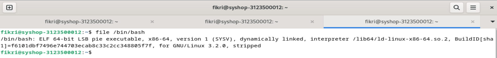

<div align="center">
  <h1 style="text-align: center;font-weight: bold">LAPORAN<br>WORKSHOP ADMINISTRASI JARINGAN</h1>
  <h4 style="text-align: center;">Dosen Pengampu : Dr. Ferry Astika Saputra, S.T., M.Sc.</h4>
</div>
<br />
<div align="center">
  
  <h3 style="text-align: center;">Disusun Oleh : </h3>
  <p style="text-align: center;">
    <strong>Fikri Athanabil Effendi (3123500012) </strong><br>
  </p>
<h3 style="text-align: center;line-height: 1.5">Politeknik Elektronika Negeri Surabaya<br>Departemen Teknik Informatika Dan Komputer<br>Program Studi Teknik Informatika<br>2024/2025</h3>
  <hr><hr>
</div>

## Bab 4: Kontrol Proses

### Komponen dari sebuah proses

Sebuah proses terdiri dari ruang alamat dan kumpulan struktur data dalam kernel. Ruang alamat adalah kumpulan halaman memori yang telah ditandai oleh kernel untuk penggunaan proses. Halaman-halaman memori ini adalah sebuah unit pengolaan memori yang digunakan untuk menyimpan kode, data, dan tumpukan proses. Struktur data dalam kernel mencatat status proses, prioritasnya, parameter penjadwalan, dan lain-lain.

Dalam kumpulan struktur data kernel merekam berbagai informasi untuk masing-masing proses, seperti:

- Proses pemetaan ruang alamat
- Status proses saat ini, seperti Running, Sleeping, dan seterusnya
- Prioritas untuk proses
- Informasi tentang sumber daya yang telah digunakan oleh proses, seperti CPU, memori, dan lain-lain
- Informasi tentang proses files dan port jaringan yang telah terbuka
- Masker sinyal, kumpulan sinyal yang saat ini diblokir
- Pemilik proses

Sebuah "Thread" adalah eksekusi konteks dalam proses. Sebuah proses memiliki beberapa thread, yang dimana semua berbagi ruang alamat dan sumber daya yang sama. Thread digunakan untuk mencapai paralelisme dalam proses yang berarti agar thread dapat bekerja secara bersama. Thread terkenal sebagai proses yang ringan dikarenakan mereka mudah dibuat dan dihancurkan dibandingkan dengan proses.

### PID: Angka Process ID

Setiap proses diidentifikasikan oleh angka proses ID yang unik. PID merupakan integer yang ditugaskan oleh kernel untuk setiap proses saat proses tersebut dibuat. PID digunakan untuk mereferensikan proses pada berbagai pemanggilan sistem.

### PPID: Angka parent process ID

Setiap proses juga diasosiakan dengan parent process, yang berarti proses yang membuat proses tersebut. PPID merupakan PID dari orang tua dari proses tersebut. PPID digunakan untuk mereferensikan orang tua dari proses pada berbagai pemanggilan sistem.

### UID dan EUID: user ID dan effective user ID

User ID merupakan ID pengguna dari pengguna yang menjalankan proses. Effective User ID merupakan UID yang proses gunakan untuk menentukan sumber daya yang proses dapat gunakan. EUID digunakan untuk mengontrol akses ke file, port jaringan, dan sumber daya lainnya.

### Siklus hidup dari proses

Untuk membuat proses baru, proses menyalin dirinya sendiri dengan fork system call. Fork membuat salinan proses yang asli, dan salinan tersebut sebagian besar identik dengan parent-nya. Proses yang baru memiliki PID berbeda dan memiliki informasi perhitungan sendiri.

Saat sistem boot, kernel secara otomatis membuat dan menginstall beberapa proses. Proses yang paling terlihat adalah `init` atau `systemd`, yang selalu memiliki angka proses 1. Proses ini mengeksekusi skrip sistem startup.

### Signals

Signal merupakan cara untuk mengirim notifikasi kepada proses. Lebih dari 30 jenis yang didefinisikan, Mereka digunakan dalam berbagai cara:

- Sebagai komunikasi antar proses
- Dikirim oleh driver terminal untuk menghentikan, menginterupsi, atau menangguhkan proses saat tombol tertentu ditekan
- Dikirim oleh administrator (dengan `kill`) untuk berbagai tujuan
- Dikirim oleh kernel saat proses melakukan kesalahan fatal
- Dikirim oleh kernel untuk memberi notifikasi untuk sebuah proses tentang kondisi khusus

### kill: Mengirim sinyal

- Perintah `kill`<br>
  Perintah ini digunakan untuk menghentikan proses dengan cara mengirim sinyal. Standarnya, perintah tersebut mengirim sinyal `TERM` yang dimana meminta proses untuk menghentikan sendiri. Namun, sinyal `TERM` bisa ditangkap, diblokir, atau diabaikan oleh proses. Menggunakan kill -9 (atau kill -KILL), sinyal KILL tidak bisa ditangkap, diblokir, atau diabaikan.<br>
  syntax perintah `kill`:

```bash
kill [-signal] pid
```

Contoh percobaan:<br>


<br><br>

- Perintah `killall`
  Perintah ini digunakan untuk menghentikan proses berdasarkan nama, bukan PID (contoh: killall firefox-esr), tetapi tidak tersedia di semua sistem.<br>
  syntax perintah `killall`:

```bash
killall [nama-proses]
```

Contoh percobaan:<br>


<br><br>

- Perintah `pkill`
  Perintah ini seperti killall tetapi memiliki lebih banyak opsi, seperti menghentikan proses berdasarkan pengguna (contoh: pkill -u fikri menghentikan semua proses milik pengguna fikri).<br>
  syntax perintah `pkill`:

```bash
pkill [opsi] <pola>
```

Contoh percobaan:<br>


### ps: Pemantauan proses

Perintah `ps` adalah alats utama milik system administrator untuk memantau proses. Perintah ini dapat menunjukkan PID, UID, prioritas, dan terminal kontrol dari proses. `ps` juga memberi informasi seberapa banyak pemakaian memori dari proses, seberapa banyak waktu CPU telah dipakai, dan kondisi proses-proses sekarang.<br>
syntax perintah `ps`:

```bash
ps [opsi]
```

Contoh percobaan:<br>


### top: Pemantauan secara interaktif

Perintah top digunakan untuk memantau sistem secara real-time dengan tampilan yang dinamis. Ini menampilkan informasi ringkasan sistem serta daftar proses atau thread yang sedang dikelola oleh kernel Linux. Informasi yang ditampilkan, seperti jenis, urutan, dan ukuran data untuk proses, dapat dikonfigurasi oleh pengguna dan disimpan agar tetap berlaku bahkan setelah sistem di-restart. Secara default, tampilan top diperbarui setiap 1-2 detik, tergantung pada sistem.

syntax perintah `top`:

```bash
ps
```

Contoh percobaan:<br>


Selain top, ada juga perintah htop, yang merupakan pemantau proses interaktif untuk sistem Unix. htop adalah aplikasi berbasis teks (untuk konsol atau terminal X) dan memerlukan library ncurses. Perintah ini mirip dengan top, tetapi memungkinkan pengguna untuk menggulir layar secara vertikal dan horizontal, sehingga semua proses yang berjalan di sistem beserta perintah lengkapnya dapat dilihat. htop juga memiliki antarmuka pengguna yang lebih baik dan lebih banyak opsi untuk operasi tertentu.

syntax perintah `htop`:

```bash
htop
```

Contoh percobaan:<br>


### nice dan renice: Merubah prioritas proses

Niceness adalah nilai numerik yang memberikan petunjuk kepada kernel tentang bagaimana suatu proses harus diperlakukan dalam hubungannya dengan proses lain yang bersaing untuk mendapatkan CPU. Proses dengan prioritas rendah adalah proses yang tidak terlalu penting dan akan mendapatkan waktu CPU lebih sedikit. Proses dengan prioritas tinggi adalah proses yang penting dan akan mendapatkan waktu CPU lebih banyak.

Niceness tinggi berarti prioritas rendah untuk proses Anda: Anda "bersikap baik" dengan memberikan prioritas kepada proses lain. Sedangakn Niceness rendah atau negatif berarti prioritas tinggi: Anda "tidak terlalu bersikap baik" karena proses Anda akan diutamakan. Rentang nilai niceness bervariasi tergantung sistem. Di Linux, rentangnya adalah -20 hingga +19, sedangkan di FreeBSD rentangnya adalah -20 hingga +20.

- nice:<br>
  Digunakan untuk memulai proses dengan nilai niceness tertentu.<br>
  syntax perintah `nice`:

```bash
nice -n nice_val [perintah]
```

Contoh percobaan:<br>


- renice: <br>
  Digunakan untuk mengubah nilai niceness dari proses yang sedang berjalan.<br>
  syntax perintah `renice`:

```bash
renice -n nice_val -p pid
```

Contoh percobaan:<br>


### /proc filesystem

Direktori /proc adalah sistem file semu (pseudo-filesystem) yang digunakan oleh kernel Linux untuk mengekspos berbagai informasi tentang status sistem, termasuk informasi tentang proses yang sedang berjalan. Meskipun namanya adalah /proc, direktori ini tidak hanya berisi informasi tentang proses, tetapi juga statistik sistem dan data lainnya.

### strace dan truss

Perintah strace (Linux) dan truss (FreeBSD) digunakan untuk melacak system calls (panggilan sistem) dan signals (sinyal) yang dilakukan oleh suatu proses. Alat ini berguna untuk melakukan debugging program atau memahami apa yang sedang dilakukan oleh suatu program.<br>
syntax perintah `strace`:

```bash
strace -p pid
```

Contoh percobaan:<br>


### Runaway Process

Runaway Process adalah proses yang berhenti merespons sistem dan berjalan di luar kendali. Proses ini mengabaikan prioritas penjadwalannya dan terus menggunakan 100% CPU, menyebabkan mesin menjadi sangat lambat karena proses lain hanya mendapatkan akses terbatas ke CPU.

Untuk menghentikan runaway proses menggunakan perintah `kill`.

Untuk menyelidiki runaway process menggunakan perintah `strace` (Linux) atau `truss` (FreeBSD).

Untuk memeriksa penggunaan filesystem menggunakan perintah `df`.

```bash
df -h
```

Contoh percobaan:<br>


Untuk melihat proses yang dibuka oleh runaway process menggunakan perintah `lsof`.

```bash
lsof -p pid
```

Contoh percobaan:<br>


### Proses Periodik

Proses periodik adalah tugas yang dijalankan secara terjadwal pada waktu tertentu. Di Linux, alat utama untuk menjalankan perintah terjadwal adalah cron (atau crond di RedHat). Selain itu, systemd timer dapat digunakan sebagai alternatif yang lebih fleksibel dan powerful.

- Cron: Menjadwalkan Perintah<br>
  Cron adalah daemon yang berjalan saat sistem boot dan tetap aktif selama sistem menyala serta membaca file konfigurasi yang disebut crontab (cron table) yang berisi daftar perintah dan jadwal eksekusinya. Perintah dalam crontab dijalankan oleh shell (sh), sehingga hampir semua perintah yang dapat dijalankan manual dari shell juga dapat dijadwalkan dengan cron.<br>
  Format crontab:<br>

```bash
*     *     *     *     *  command_to_execute
-     -     -     -     -
|     |     |     |     |
|     |     |     |     +----- hari dalam minggu (0-6, 0=Minggu)
|     |     |     +------- bulan (1-12)
|     |     +--------- tanggal (1-31)
|     +----------- jam (0-23)
+------------- menit (0-59)
```

Contoh penggunaan crontab<br>
Menjalankan perintah setiap hari pukul 2:30 pagi:

```bash
30 2 * * * command
```

Menjalankan skrip Python setiap tanggal 1 pukul 2:30 pagi:

```bash
30 2 1 * * /usr/bin/python3 /path/to/script.py
```

Menjalankan perintah setiap 30 menit:

```bash
*/30 * * * * command
```

- Systemd Timer: Alternatif Modern untuk Cron<br>
  Systemd timer adalah file konfigurasi unit systemd yang berekstensi `.timer`. Timer ini lebih fleksibel dan powerful dibanding cron, karena dapat diaktifkan berdasarkan waktu, boot sistem, atau event tertentu diaktifkan oleh service unit yang sesuai, dan dapat dikelola menggunakan perintah `systemctl`.<br>
  Contoh Systemd Timer:<br>

```bash
systemctl list-timers
```

Contoh file timer (logrotate.timer):<br>

```bash
[Unit]
Description=Daily rotation of log files

[Timer]
OnCalendar=daily
AccuracySec=1h
Persistent=true

[Install]
WantedBy=timers.target
```

- Kegunaan Umum Tugas Terjadwal:<br>
  - Mengirim Email: Mengirim laporan atau hasil perintah secara otomatis melalui email.<br>
  - Membersihkan Filesystem: Menjalankan skrip untuk menghapus file lama, seperti membersihkan direktori sampah setiap hari.<br>
  - Rotasi Log File: Membagi file log menjadi beberapa segmen berdasarkan ukuran atau tanggal, dan menyimpan versi lama.<br>
  - Menjalankan Batch Jobs: Menjalankan tugas panjang seperti pemrosesan pesan antrian atau ETL (Extract, Transform, Load) ke data warehouse.<br>
  - Backup dan Mirroring: Menjadwalkan backup otomatis ke sistem remote atau membuat mirror (salinan byte-per-byte) menggunakan rsync.<br>

## Bab 5: Filesystem

Filesystem bertujuan untuk merepresentasikan dan mengatur sumber daya penyimpanan sistem.
Filesystem dapat dianggap terdiri dari empat komponen utama:

- Namespace - cara untuk memberi nama objek dan mengaturnya dalam hierarki.
- API - sekumpulan system calls untuk menavigasi dan memanipulasi objek.
- Model keamanan - skema untuk melindungi, menyembunyikan, atau berbagi akses.
- Implementasi - perangkat lunak yang menghubungkan model logis dengan perangkat keras.

Filesystem berbasis disk yang umum digunakan antara lain ext4, XFS, UFS, ZFS (Oracle), dan Btrfs. Beberapa lainnya seperti VxFS (Veritas) dan JFS (IBM) juga tersedia. Ada pula filesystem "asing" seperti FAT/NTFS (Windows) dan ISO 9660 (CD/DVD).

Filesystem modern umumnya berfokus pada peningkatan kecepatan dan keandalan fungsionalitas tradisional, atau menambahkan fitur tambahan di atas semantik filesystem standar.

### Pathname

Kata "folder" hanyalah kebocoran linguistik dari dunia Windows dan macOS. Istilah ini memiliki arti yang sama dengan direktori (lebih teknis).

Daftar direktori yang mengarah ke suatu file disebut jalur (pathname). Jalur adalah rangkaian teks yang menggambarkan lokasi file dalam hierarki filesystem. Jalur bisa bersifat absolut (contoh: /home/username/file.txt) atau relatif (contoh: ./file.txt).

### Filesystem Mounting dan Unmounting

Filesystem terdiri dari bagian-bagian kecil—yang juga disebut "filesystem"—yang masing-masing mencakup satu direktori beserta subdirektori dan file di dalamnya. Istilah file tree (pohon file) digunakan untuk menggambarkan struktur keseluruhan, sementara "filesystem" merujuk pada cabang-cabang yang terpasang di pohon tersebut.

Umumnya, filesystem ditambahkan ke pohon menggunakan perintah mount. Perintah ini memetakan direktori dalam file tree yang ada (disebut mount point) ke root filesystem baru.<br>
Contoh:

```bash
mount /dev/sda4 /users
```

Linux memiliki opsi lazy unmount (umount -l) yang menghapus filesystem dari hierarki penamaan tetapi tidak benar-benar melepaskannya sampai tidak digunakan lagi.

umount -f adalah forceful unmount, berguna ketika filesystem sedang sibuk. Daripada langsung menggunakan umount -f, Anda bisa menggunakan lsof atau fuser untuk mencari proses yang menggunakan filesystem dan menghentikannya.<br>
Contoh:

```bash
lsof /home/fikri
```

Contoh percobaan:<br>


Output lsof akan menampilkan daftar proses yang mengakses direktori/file tersebut. Untuk menyelidiki detail proses, gunakan ps:<br>

```bash
ps up "1267 1445"
```

Contoh percobaan:<br>


Hasilnya akan menampilkan informasi seperti PID, penggunaan CPU/MEM, dan perintah yang dijalankan.

### Organisasi Pohon File di Sistem UNIX

Berbagai konvensi penamaan yang tidak kompatibel digunakan secara bersamaan, dan jenis file berbeda tersebar secara acak dalam namespace. Inilah yang membuat upgrade sistem operasi menjadi sulit.

Struktur Root Filesystem:

- /(root): Direktori utama yang mencakup set minimal file dan subdirektori.
- /boot: Biasanya menyimpan kernel OS, tetapi nama dan lokasi pastinya bisa bervariasi. Di BSD dan beberapa UNIX lain, kernel terdiri dari beberapa komponen, bukan satu file.
- /etc: Berisi file konfigurasi dan sistem yang kritis.
- /sbin dan /bin: Utilitas penting untuk administrasi sistem.
- /tmp: File sementara (tidak selalu bagian dari root filesystem).
- /dev: Dulunya bagian dari root filesystem, sekarang menjadi filesystem virtual yang dimount terpisah.

Direktori Lain:

- /lib atau /lib64: Menyimpan shared library dan komponen seperti C preprocessor. Di beberapa sistem, ini dipindahkan ke /usr/lib, dengan /lib sebagai symbolic link.
- /usr: Menyimpan program standar non-kritis, manual daring (man pages), dan library. Di FreeBSD, konfigurasi lokal banyak disimpan di /usr/local.
- /var: Berisi direktori spool (email/cetak), file log, data akunting, dan file yang sering berubah atau berbeda antar host.

/usr dan /var harus tersedia agar sistem dapat boot hingga mode multiuser. Tanpa keduanya, sistem mungkin hanya bisa boot ke mode single-user (pemeliharaan). Direktori seperti /usr/bin (program pengguna) dan /var/log (file log) adalah contoh bagian krusial dari struktur ini.

### Tipe File

Filesystem UNIX umumnya mendefinisikan 7 jenis file:

- File Reguler
- Direktori
- File Device Karakter
- File Device Blok
- Socket Domain Lokal
- Pipa Bernama (FIFO)
- Tautan Simbolik

Cara mengetahui Jenis File gunakan perintah file:

```bash
file /bin/bash
```

Contoh percobaan:<br>


Gunakan ls -ld untuk menampilkan informasi dari direktori:

```bash
ls -ld
```

Contoh percobaan:<br>


Berikut penjelasan singkat mengenai jenis file:

- File Reguler: Kumpulan byte tanpa struktur khusus (contoh: file teks, program, library).
- Direktori: Referensi bernama ke file/direktori lain.
- Hard Link: Memberi nama alternatif untuk file yang sama.

```bash
ln /etc/passwd /tmp/passwd  # Membuat hard link
ls -i /etc/passwd /tmp/passwd  # Menampilkan inode yang sama
```

Contoh percobaan:<br>


- File Device (Karakter/Blok): Digunakan untuk berkomunikasi dengan hardware (contoh: /dev/tty0 untuk port serial).
  - Nomor major: Mengidentifikasi driver.
  - Nomor minor: Mengidentifikasi unit fisik (misal: /dev/tty0 = major 4, minor 0).
- Socket Domain Lokal: Memungkinkan komunikasi antar-proses di host yang sama (contoh: syslog, X Window System).
- Pipa Bernama (FIFO): Jalur komunikasi antar-proses dalam host.
- Tautan Simbolik: Tautan fleksibel ke file/direktori (bisa lintas filesystem).

```bash
$ ln -s /bin /usr/bin  # Membuat tautan simbolik
$ ls -l /usr/bin
```

Contoh percobaan:<br>


Catatan tentang /dev:
Dulunya dibuat manual dengan mknod, sekarang /dev adalah filesystem virtual yang dikelola otomatis oleh kernel dan daemon.

### Atribut File

Di model filesystem UNIX/Linux, setiap file memiliki 9 bit izin yang menentukan siapa yang dapat membaca, menulis, dan mengeksekusi file. Bersama dengan 3 bit tambahan (yang memengaruhi operasi program eksekusi), bit-bit ini membentuk mode file.

Kedua belas bit mode ini disimpan bersama 4 bit informasi tipe file. Keempat bit tipe file ditetapkan saat file dibuat dan tidak dapat diubah. Namun, pemilik file atau superuser dapat memodifikasi dua belas bit mode menggunakan perintah chmod.

Contoh:

- Bit izin: rwxr-xr-- (9 bit).
- Bit tambahan: Seperti setuid, setgid, sticky bit (3 bit).
- Bit tipe file: Menunjukkan jenis file (contoh: regular file, direktori).

### Pengizinan Bit

BBit izin pada file dibagi menjadi tiga grup, masing-masing terdiri dari tiga bit. Grup pertama untuk pemilik file, grup kedua untuk grup file, dan grup ketiga untuk pengguna lain. Anda bisa menggunakan nama "Hugo" untuk mengingat urutan grup ini: u untuk pemilik (user), g untuk grup (group), dan o untuk lainnya (others).

Notasi oktal (basis 8) juga bisa digunakan karena setiap digit dalam notasi oktal mewakili tiga bit. Tiga bit paling atas (dengan nilai oktal 400, 200, dan 100) mewakili pemilik file, tiga bit di tengah (dengan nilai oktal 40, 20, dan 10) mewakili grup file, dan tiga bit paling bawah (dengan nilai oktal 4, 2, dan 1) mewakili pengguna lain.

Pada file reguler, bit baca memungkinkan file untuk dibaca, bit tulis memungkinkan file untuk dimodifikasi atau dipotong; namun, kemampuan untuk menghapus atau mengganti nama (atau menghapus dan membuat ulang) file dikendalikan oleh izin pada direktori induknya, di mana pemetaan [nama-ke-ruang] data dipertahankan.

Bit eksekusi memungkinkan file untuk dieksekusi. Ada dua jenis file eksekusi:

- biner: yang dijalankan langsung oleh CPU
- skrip: yang harus diinterpretasi oleh program seperti shell atau Python.
  Secara konvensi, skrip dimulai dengan baris shebang yang memberi tahu kernel interpreter mana yang harus digunakan.

```bash
#!/usr/bin/perl
```

File eksekusi non-biner yang tidak menentukan interpreter dianggap sebagai skrip sh. Kernel memahami sintaks #! (shebang) dan bertindak langsung berdasarkan itu. Namun, jika interpreter tidak ditentukan dengan lengkap dan benar, kernel akan menolak file tersebut. Shell kemudian mengambil alih dan mencoba menginterpretasi file sebagai skrip shell.

Untuk direktori, bit eksekusi (sering disebut bit pencarian atau pemindaian) memungkinkan direktori untuk dimasuki atau dilalui saat pathname dievaluasi, tetapi tidak untuk mencantumkan isinya. Kombinasi bit baca dan eksekusi memungkinkan direktori untuk dibaca dan isinya dicantumkan. Kombinasi bit tulis dan eksekusi memungkinkan file untuk dibuat, dihapus, dan diganti namanya di dalam direktori.

### bit setuid dan setgid

Bit dengan nilai oktal 4000 dan 2000 masing-masing adalah bit setuid dan setgid. Ketika bit setuid diatur pada sebuah file, pemilik file sementara diubah menjadi pemilik file saat file tersebut dieksekusi. Ketika bit setgid diatur pada sebuah file, grup file sementara diubah menjadi grup file saat file tersebut dieksekusi.

Ketika bit setgid diatur pada sebuah direktori, file-file yang baru dibuat di dalam direktori tersebut akan mengambil kepemilikan grup dari direktori, bukan grup default dari pengguna yang membuat file. Ini memudahkan berbagi file di antara sekelompok pengguna.

### Sticky Bit

Bit dengan nilai oktal 1000 adalah sticky bit. Ketika diatur pada sebuah direktori, sticky bit mencegah pengguna menghapus atau mengganti nama file yang bukan milik mereka. Ini berguna untuk direktori seperti /tmp yang digunakan bersama oleh banyak pengguna.

### ls: list dan inspect files

Perintah ls digunakan untuk menampilkan daftar file dan direktori. Ini juga bisa digunakan untuk memeriksa atribut file dan direktori. Opsi -l membuat ls menampilkan format panjang, yang mencakup mode file, jumlah hard link ke file, pemilik file, grup file, ukuran file dalam byte, waktu modifikasi file, dan nama file.

Semua direktori memiliki setidaknya dua hard link: satu dari direktori itu sendiri (entri .) dan satu dari direktori induknya (entri ..).

Output ls sedikit berbeda untuk file device. Contohnya:

```bash
$ ls -l /dev/tty0
```

Contoh percobaan:<br>


Huruf c di awal baris menunjukkan bahwa file tersebut adalah file device karakter. Angka 4, 0 di akhir baris adalah nomor major dan minor device.

### chmod: merubah izin

Perintah chmod digunakan untuk mengubah mode file. Anda bisa menggunakan notasi oktal atau notasi simbolik.

Contoh sintaks mnemonik chmod:

- u+w: Menambahkan izin tulis untuk pemilik file.
- ug=rw,o=r: Memberikan izin baca/tulis untuk pemilik dan grup, serta izin baca untuk pengguna lain.
- a-x: Menghapus izin eksekusi untuk semua pengguna.
- ug=srx,o=: Mengatur bit setuid, setgid, dan sticky untuk pemilik dan grup (baca/eksekusi).
- g=u: Membuat izin grup sama dengan izin pemilik.

Anda juga bisa menentukan mode dengan menyalin mode dari file lain menggunakan opsi --reference. Contoh:

```bash
chmod --reference=file_sumber file_target
```

### chown: merubah kepemilikan

Perintah chown digunakan untuk mengubah kepemilikan dan grup sebuah file. Opsi -R membuat chown mengubah kepemilikan isi file secara rekursif. Contoh:

```bash
chown -R fikri:users /home/fikri
```

Contoh percobaan:<br>


### chgrp: Mengubah Grup

Perintah chgrp digunakan untuk mengubah grup sebuah file. Opsi -R membuat chgrp mengubah grup isi file secara rekursif. Contoh:

```bash
$ chgrp -R users /home/fikri
```

Contoh percobaan:<br>


### umask: Mengatur Izin Default

Perintah umask mengatur izin default untuk file dan direktori baru. umask adalah bit mask yang dikurangi dari izin default untuk menentukan izin aktual. Contoh:

```bash
umask 022
```

Contoh percobaan:<br>


Tabel konversi umask:
| Octal | Binary | Perms | Octal | Binary | Perms |
| ----- | ------ | ----- | ----- | ------ | ----- |
| 0 | 000 | rwx | 4 | 100 | -wx |
| 1 | 001 | rw- | 5 | 101 | -w- |
| 2 | 010 | r-x | 6 | 110 | --x |
| 3 | 011 | r-- | 7 | 111 | --- |
Contoh: umask 027 memberikan izin rwx untuk pemilik, rx untuk grup, dan tanpa izin untuk pengguna lain.

### Access Control Lists (ACLs)

Model izin Unix tradisional sederhana tetapi memiliki keterbatasan, seperti sulitnya memberikan banyak pemilik atau izin berbeda untuk grup pengguna. ACL memperluas model ini dengan memungkinkan banyak pemilik dan izin berbeda untuk file yang sama.

Setiap aturan dalam ACL disebut Access Control Entry (ACE), yang terdiri dari:

- Spesifikasi pengguna/grup (nama pengguna, grup, atau kata kunci seperti owner/other).
- Mask izin (set izin).
- Tipe (allow atau deny).

Perintah getfacl menampilkan ACL file, dan setfacl mengatur ACL file. Contoh:

```bash
getfacl /etc/passwd
setfacl -m u:fikri:rw /etc/passwd
```

Contoh percobaan:<br>


### POSIX ACLs: ACL tradisional Unix, didukung oleh Linux, FreeBSD, dan Solaris.

Format:
| Format | Contoh | Mengatur izin untuk |
| --------------------- | --------------- | ---------------------------- |
| user::perms | user:rw- | Izin untuk pemilik file |
| user:username:perms | user:abdou:rw- | Izin untuk pengguna tertentu |
| group::perms | group:r-x | Izin untuk grup file |
| group:groupname:perms | group:users:r-x | Izin untuk grup tertentu |
| mask::perms | mask::rwx | Izin maksimum |
| other::perms | other::r-- | Izin untuk pengguna lain |

Contoh:

```bash
$ setfacl -m user:fikri:rwx,group:users:rwx,other::r /home/fikri
$ getfacl --omit-header /home/fikri
```

Contoh percobaan:<br>


### NFSv4 ACLs

ACL yang lebih baru dan lebih powerful, didukung oleh Linux dan FreeBSD. Memiliki fitur tambahan seperti default ACL untuk mengatur ACL file/direktori baru.

## Bab 6: Instalasi dan Manajemen Perangkat lunak

### Instalasi Sistem operasi

Distribusi Linux dan FreeBSD memiliki prosedur instalasi dasar yang cukup mudah. Untuk mesin fisik, Anda dapat melakukan booting dari CD, DVD, atau USB drive. Untuk mesin virtual, Anda dapat melakukan booting dari file ISO. Menginstal sistem operasi dasar dari media lokal cukup sederhana berkat aplikasi GUI yang memandu Anda melalui prosesnya.

### Instalasi dari Jaringan

Jika Anda harus menginstal OS pada lebih dari satu komputer, Anda akan cepat mencapai batas pendekatan menggunakan media lokal. Proses ini memakan waktu, rentan kesalahan, dan membosankan karena harus mengulangi langkah yang sama berulang kali. Solusinya adalah menginstal OS dari server jaringan. Ini adalah praktik umum di pusat data dan lingkungan cloud.

Metode yang paling umum menggunakan **DHCP** dan **TFTP** untuk melakukan booting sistem tanpa media fisik. Sistem kemudian mengambil file instalasi OS dari server jaringan menggunakan **HTTP**, **FTP**, atau **NFS**. File instalasi bisa berada di server yang sama atau di server yang berbeda.

Kita dapat menyiapkan instalasi sepenuhnya otomatis melalui **PXE** (Preboot eXecution Environment). Skema ini adalah standar dari Intel yang memungkinkan sistem melakukan booting dari antarmuka jaringan.

PXE berfungsi seperti sistem operasi mini yang berada di ROM pada kartu jaringan. Ini mengekspos kemampuan jaringan melalui API standar yang digunakan oleh BIOS sistem. Kerjasama ini memungkinkan satu boot loader untuk melakukan netboot pada PC yang mendukung PXE tanpa harus menyediakan driver khusus untuk setiap kartu jaringan.

### Linux Package Management Systems

Dua format paket umum digunakan pada sistem Linux. Red Hat, CentOS, SUSE, Amazon Linux, dan beberapa distribusi lainnya menggunakan RPM. Debian dan Ubuntu menggunakan format .deb yang terpisah tetapi sama populernya. Kedua format ini secara fungsional serupa.

Sistem pengemasan RPM dan .deb sekarang berfungsi sebagai alat manajemen konfigurasi dua lapis. Pada tingkat paling dasar adalah alat yang menginstal, menghapus, dan mengkueri paket: `rpm` untuk RPM dan `dpkg` untuk .deb.

Di atas perintah-perintah ini adalah sistem yang tahu cara menemukan dan mengunduh paket dari internet, menganalisis ketergantungan antar-paket, dan memutakhirkan semua paket pada sistem. yum (Yellowdog Updater, Modified) bekerja dengan sistem RPM. APT (Advanced Package Tool) berasal dari dunia .deb tetapi bekerja dengan baik untuk paket .deb dan RPM.

### High-Level Package Management

Alat manajemen paket tingkat tinggi adalah yang paling sering Anda gunakan. Alat ini memungkinkan Anda menginstal, menghapus, dan memutakhirkan paket. Mereka juga memungkinkan Anda mencari paket dan menampilkan daftar paket yang terinstal di sistem Anda.

- Package repositories
  Distributor Linux mengelola repositori perangkat lunak yang bekerja sama dengan sistem manajemen paket yang mereka pilih. Konfigurasi default untuk sistem manajemen paket biasanya mengarah ke satu atau lebih server web atau FTP terkenal yang dikendalikan oleh distributor.

  - Sebuah release adalah snapshot yang konsisten dari kumpulan paket.
  - Sebuah komponen adalah subset perangkat lunak dalam suatu release.
  - Arsitektur mewakili kelas perangkat keras, dengan asumsi bahwa mesin dalam kelas arsitektur yang sama cukup mirip sehingga dapat menjalankan biner yang sama. Arsitektur adalah instance dari release, misalnya, arsitektur i386 dari release Fedora 20.

- APT: Advanced Package Tool
  APT adalah sekumpulan alat untuk mengelola paket Debian. Ini adalah sistem manajemen paket yang paling banyak digunakan untuk sistem berbasis Debian. APT adalah kumpulan alat yang bekerja bersama untuk menyediakan sistem manajemen paket yang lengkap. Alat-alat tersebut adalah:

  - apt-get: Alat baris perintah untuk menangani paket. Ini melakukan tugas manajemen paket seperti instalasi, penghapusan, dan pemutakhiran.
  - apt-cache: Alat untuk mencari dan mengkueri cache paket APT.
  - apt-file: Alat untuk mencari file di dalam paket.
  - apt-show-versions: Alat untuk menampilkan versi paket.
  - aptitude: Antarmuka tingkat tinggi untuk sistem manajemen paket. Ini dapat digunakan untuk melakukan sebagian besar tugas yang bisa dilakukan oleh apt-get, dan banyak lagi.
  - apt-mirror: Alat yang memungkinkan Anda membuat mirror dari repositori paket.
    Aturan pertama dalam menggunakan APT pada sistem Ubuntu adalah mengabaikan keberadaan dselect, yang bertindak sebagai frontend untuk sistem paket Debian.

- yum: Yellowdog Updater, Modified
  yum adalah manajer paket untuk sistem Linux yang kompatibel dengan RPM. Ini adalah alat tingkat tinggi untuk mengelola paket. Yum melakukan resolusi dependensi saat menginstal, memperbarui, dan menghapus paket. Ini dapat mengelola paket dari repositori yang terinstal, dan juga dapat melakukan operasi baris perintah pada paket individu.

### Konfigurasi dan Lokalisasi Perangkat Lunak

Mengadaptasi sistem ke lingkungan lokal (atau cloud) Anda adalah salah satu tantangan utama dalam administrasi sistem. Menangani masalah lokalisasi dengan cara yang terstruktur dan dapat direproduksi membantu menghindari terciptanya sistem "snowflake" yang sulit dipulihkan setelah insiden besar.
