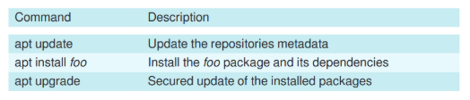

  <h1 style="text-align: center;font-weight: bold">LAPORAN WORKSHOP ADMINISTRASI JARINGAN</h1>
  <h4 style="text-align: center;">Dosen Pengampu : Dr. Ferry Astika Saputra, S.T., M.Sc.</h4>

 

  
  <h3 style="text-align: center;">Disusun Oleh : </h3>
  

    <strong>Fikri Athanabil Effendi (3123500012) </strong> 
  

<h3 style="text-align: center;line-height: 1.5">Politeknik Elektronika Negeri Surabaya Departemen Teknik Informatika Dan Komputer Program Studi Teknik Informatika 2024/2025</h3>
  

1. **Instalasi NTP Client**
1. Buka terminal dan jalankan ‘sudo apt update’ untuk memperbarui daftar paket yang tersedia dan versinya dalam sistem Linux/Debian

   

1. Jalankan perintah ‘sudo apt -y install ntpsec’ untuk Memasang (install) paket ntpsec, yang berfungsi sebagai Network Time Protocol (NTP) client untuk sinkronisasi waktu.

   

1. Edit file konfigurasi **ntpsec** di ‘sudo nano /etc/ntpsec/ntp.conf’

   

1. Cari baris berikut:

   ` `Command baris tersebut dan tambahkan server 0.id.pool.ntp.org iburst

   server 1.id.pool.ntp.org iburst

   server 2.id.pool.ntp.org iburst

   server 3.id.pool.ntp.org iburst

   

1. Setelah itu Restart NTP Service

   

1. Cek status apakah service sudah aktif:

   

1. Gunakan perintah berikut untuk memverifikasi server NTP yang digunakan:

   

1. **Instalasi Samba**
1. Buka terminal dan jalankan ‘sudo apt update’ untuk memperbarui daftar paket yang tersedia dan versinya dalam sistem Linux/Debian

   

1. Jalankan perintah ‘sudo apt -y install samba smbclient cifs-utils’ untuk **menginstal paket-paket yang dibutuhkan** dalam konfigurasi Samba di Debian 12.\*\*

   

1. Jalankan perintah [‘mkdir ](https://www.server-world.info/en/command/html/mkdir.html)/home/share’ untuk membuat folder ‘/home/share’

   

1. Jalankan perintah [‘chmod ](https://www.server-world.info/en/command/html/chmod.html)777 /home/share’ untuk **mengubah izin akses (permission) pada folder /home/share** agar bisa dibaca, ditulis, dan dieksekusi oleh semua user.

   

1. Jalankan perintah ‘sudo nano /etc/samba/smb.conf’ untuk mengedit file pada /etc/samba/smb.conf

   

1. Edit file pada bagian seperti pada gambar yang saya lampirkan

   

   

3\. Debian 12 sysadmin

- Memodifikasi repositori

`       `Untuk memodifikasi software recource jalankan perintah ‘apt edit-sources’

   

`       `Perintah tersebut untuk membuka file di text editor(nano atau vim)jika sudah selesai mengedit save file dengan menggunakan [ctrl+x]

Contoh:

   

- Command untuk mencari dan menampilkan informasi

   

- Perintah untuk Mode administrasi untuk maintenance system

   

   

- Command untuk update info repo + update system + membersihkan cache packages

   

- Untuk menghapus packages yang tidak terpakai, dependensi yang tidak penting dan file konfigurasi versi lama di mode admin

   

1. **Software: The Simplified Package Manager**

Bagian ini menjelaskan sistem manajemen paket di Debian 12, yang bertujuan untuk mempermudah instalasi, pembaruan, dan penghapusan perangkat lunak.

1. **APT (Advanced Package Tool)**

APT adalah sistem manajemen paket utama di Debian. Beberapa perintah penting yang dibahas dalam bagian ini:

- apt update → Memperbarui daftar paket dari repository.
- apt upgrade → Memperbarui semua paket ke versi terbaru.
- apt install <package_name> → Menginstal paket tertentu.
- apt remove <package_name> → Menghapus paket.
- apt autoremove → Menghapus paket yang tidak lagi diperlukan.

APT menangani dependensi secara otomatis, memastikan bahwa semua pustaka yang dibutuhkan diinstal bersama aplikasi utama.

2. **dpkg (Debian Package Manager)**

Selain APT, Debian juga memiliki _dpkg_, alat manajemen paket tingkat rendah yang bekerja dengan file .deb. Beberapa perintah dasar:

- dpkg -i <file.deb> → Menginstal paket dari file .deb.
- dpkg -r <package_name> → Menghapus paket.
- dpkg -l → Menampilkan daftar paket yang terinstal. 

2. **System Services Management (Manajemen Layanan Sistem)**

Bagian ini membahas cara mengelola layanan menggunakan _systemd_, sistem inisialisasi modern yang menggantikan _SysVinit_.

1. **Perintah systemctl untuk Mengelola Layanan**

- systemctl start <service> → Menjalankan layanan.
- systemctl stop <service> → Menghentikan layanan.
- systemctl restart <service> → Memulai ulang layanan.
- systemctl enable <service> → Mengaktifkan layanan agar berjalan otomatis saat boot.
- systemctl disable <service> → Menonaktifkan layanan dari startup.

2. **Melihat Status Layanan**

Untuk memeriksa status layanan, gunakan:

systemctl status <service>

Contoh:

systemctl status apache2

Perintah ini akan menampilkan informasi apakah layanan _Apache_ sedang berjalan atau tidak. 

3. **User and Permission Management (Manajemen Pengguna dan Izin)**

Bagian ini membahas cara mengelola pengguna, grup, dan izin file dalam sistem Debian 12.

1. **Manajemen Pengguna**

- adduser <username> → Menambahkan pengguna baru.
- deluser <username> → Menghapus pengguna.
- usermod -aG <group> <username> → Menambahkan pengguna ke grup.

2. **Manajemen Izin File**

Debian menggunakan model izin Unix dengan tiga tingkat:

- **Owner (Pemilik)**
- **Group (Grup)**
- **Others (Lainnya)**

Gunakan perintah berikut untuk mengatur izin:

- chmod → Mengubah izin file.
- chown → Mengubah pemilik file.
- ls -l → Menampilkan daftar file dengan izin yang dimiliki. Contoh:

chmod 755 script.sh

chown user:user script.sh 

4. **Networking Basics (Dasar-dasar Jaringan)**

Bagian ini mencakup pengaturan jaringan di Debian 12.

1. **Konfigurasi IP dan Hostname**

- ip a → Menampilkan konfigurasi IP.
- hostnamectl set-hostname <new_hostname> → Mengubah nama host.

2. **Pengelolaan Firewall dengan UFW (Uncomplicated Firewall)**

- ufw enable → Mengaktifkan firewall.
- ufw allow <port> → Mengizinkan lalu lintas ke port tertentu.
- ufw status → Memeriksa status firewall. 

5. **System Monitoring and Logs (Pemantauan Sistem dan Log)** Bagian ini membahas alat pemantauan sistem seperti:

- top / htop → Menampilkan proses yang berjalan.
- df -h → Memeriksa penggunaan disk.
- free -m → Melihat penggunaan RAM.
- journalctl → Melihat log systemd.
