<div align="center">
  <h1 style="text-align: center;font-weight: bold">LAPORAN RESMI<br>WORKSHOP ADMINISTRASI JARINGAN</h1>
  <h4 style="text-align: center;">Dosen Pengampu : Dr. Ferry Astika Saputra, S.T., M.Sc.</h4>
</div>
<br />
<div align="center">
  
  <h3 style="text-align: center;">Disusun Oleh : </h3>
  <p style="text-align: center;">
    <strong>Fikri Athanabil Effendi (3123500012) </strong><br>
  </p>
<h3 style="text-align: center;line-height: 1.5">Politeknik Elektronika Negeri Surabaya<br>Departemen Teknik Informatika Dan Komputer<br>Program Studi Teknik Informatika<br>2024/2025</h3>
  <hr><hr>
</div>

## Daftar Isi

- [Daftar Isi](#daftar-isi)
- [Dasar Teori](#dasar-teori)
  - [Pengertian DNS](#pengertian-dns)
  - [Fitur-Fitur DNS](#fitur-fitur-dns)
  - [Domains dan Namespaces](#domains-dan-namespaces)
  - [Zones and Delegation Zone](#zones-and-delegation-zone)
  - [Nameservers](#nameservers)
  - [DNS Resource Records](#dns-resource-records)
  - [DNS Query](#dns-query)
- [Perintah-Perintah DNS](#perintah-perintah-dns)
  - [`Less /etc/nsswitch.conf`](#less-etcnsswitchconf)
  - [`less /etc/host.conf`](#less-etchostconf)
  - [`nano /etc/hosts`](#nano-etchosts)
  - [`sudo less /etc/resolv.conf`](#sudo-less-etcresolvconf)
  - [`nslookup`](#nslookup)
  - [`less /usr/share/dns/root.hints`](#less-usrsharednsroothints)
- [Ekosistem Internet](#ekosistem-internet)
  - [Internet](#internet)
  - [IP Addressing \& Routing System](#ip-addressing--routing-system)
  - [Routing](#routing)
  - [Peering Connections](#peering-connections)
  - [Edge Provider Routing Policy](#edge-provider-routing-policy)
  - [Transit Provider Routing Policy](#transit-provider-routing-policy)
  - [Content Provider Routing Policy](#content-provider-routing-policy)
  - [Naming System](#naming-system)
  - [Root Servers](#root-servers)
  - [Standards Organizations](#standards-organizations)
  - [Internet Engineering Task Force (IETF)](#internet-engineering-task-force-ietf)
  - [Service Providers](#service-providers)
  - [Internet Exchange Point (IXP)](#internet-exchange-point-ixp)
  - [Registries](#registries)
  - [Top Level Registries](#top-level-registries)
  - [Second Tier Registries](#second-tier-registries)
  - [Clearing Houses](#clearing-houses)
  - [Internet Route Registries (IRR)](#internet-route-registries-irr)
  - [Network Operators Groups (NOGs)](#network-operators-groups-nogs)
- [Instalasi DNS Server](#instalasi-dns-server)

## Dasar Teori

### Pengertian DNS

DNS (Domain Name System) adalah sistem yang bertugas menerjemahkan nama domain yang mudah diingat manusia (seperti example.com) menjadi alamat IP numerik yang dipahami oleh komputer untuk komunikasi. Dengan adanya DNS, pengguna tidak perlu menghafal deretan angka alamat IP, sehingga akses ke situs web dan layanan internet menjadi jauh lebih praktis dan user-friendly.

### Fitur-Fitur DNS

Globally Distributed:<br>
Beberapa server DNS dikelola oleh operator yang berbeda.

Loosely Coherent<br>
Meskipun didistribusikan, server tetap menjadi bagian dari satu sistem DNS global.

Scalable:<br>
Sistem dapat diperluas dan beberapa server dapat ditambahkan.

Reliable:<br>
Kritis bagi fungsi internet, sehingga harus dapat diandalkan.

Dynamic:<br>
Siapa pun dapat menambahkan domain dan record tanpa menyebabkan gangguan.

### Domains dan Namespaces

Namespace dalam DNS adalah ruang nama hierarkis yang digunakan untuk mengorganisasi dan mengidentifikasi domain secara unik. Domain sendiri dibagi menjadi beberapa level, termasuk Top-Level Domain (TLD) seperti .com, .org, dan .id, Second-Level Domain (SLD) seperti example.com, serta Subdomain seperti blog.example.com. Struktur ini memungkinkan pengelolaan yang lebih terorganisir dan fleksibel.

### Zones and Delegation Zone

dalam DNS adalah bagian dari namespace yang dikelola oleh satu otoritas administrasi tertentu. Delegation terjadi saat otoritas utama mendelegasikan pengelolaan sebagian zone-nya ke pihak lain. Contohnya, pengelolaan subdomain shop.example.com dapat diberikan kepada tim IT terpisah yang bertanggung jawab untuk mengatur zona tersebut secara spesifik.

### Nameservers

Nameserver adalah server yang menyimpan informasi DNS dan bertugas menjawab permintaan klien terkait penerjemahan nama domain. Nameserver dapat berupa authoritative nameserver, yang memegang data asli untuk zona tertentu, atau recursive nameserver, yang mencari jawaban ke berbagai sumber hingga mendapatkan hasil.

### DNS Resource Records

Resource record dalam DNS adalah entri database yang menyimpan informasi spesifik tentang nama domain. Beberapa jenis record penting mencakup A (alamat IP untuk domain), CNAME (alias untuk domain lain), MX (server email), dan TXT (informasi tambahan). Record-record ini menentukan fungsi dan pengaturan setiap domain.

### DNS Query

DNS Query adalah proses permintaan informasi DNS dari klien ke server. Terdapat beberapa jenis query, seperti recursive query (di mana server bertanggung jawab untuk memberikan jawaban lengkap) dan iterative query (di mana server memberikan referensi ke server lain untuk melanjutkan pencarian jawaban).

## Perintah-Perintah DNS

### `Less /etc/nsswitch.conf`

Penjelasan:<br>
Perintah ini digunakan untuk membaca isi file konfigurasi nsswitch.conf, yang menentukan urutan pencarian nama dalam sistem seperti pencarian melalui file lokal, DNS, atau layanan lainnya. Dengan `less`, file ini dapat dibaca tanpa risiko mengubah isinya.
Percobaan:
<br><div style=width:500;>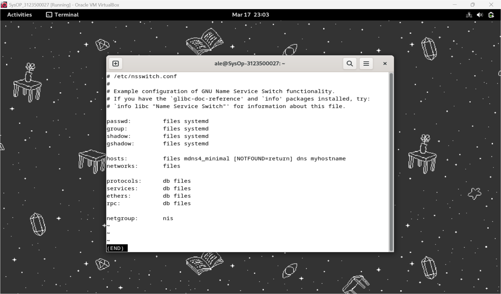</div>

### `less /etc/host.conf`

Penjelasan:<br>
Digunakan untuk membaca file konfigurasi `host.conf`, yang mengatur cara sistem menangani resolusi nama host dan pengaturan multiple IP untuk satu host. Perintah ini memastikan bahwa file dapat ditinjau tanpa perubahan.
Percobaan:
<br><div style=width:500;></div>

### `nano /etc/hosts`

Penjelasan:<br>
Membuka file `/etc/hosts` menggunakan editor teks nano. File ini memetakan nama host ke alamat IP secara manual. Dengan nano, entri baru dapat ditambahkan atau diedit untuk keperluan tertentu, seperti bypass DNS.
Percobaan:
<br><div style=width:500;>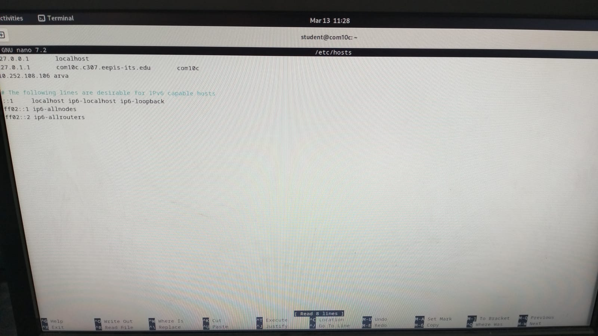</div>

### `sudo less /etc/resolv.conf`

Penjelasan:<br>
Digunakan untuk membaca file` resolv.conf`, yang menentukan server DNS yang digunakan oleh sistem. Karena file ini memiliki hak akses terbatas, perintah sudo diperlukan untuk membacanya tanpa memodifikasi.
Percobaan:
<br><div style=width:500;>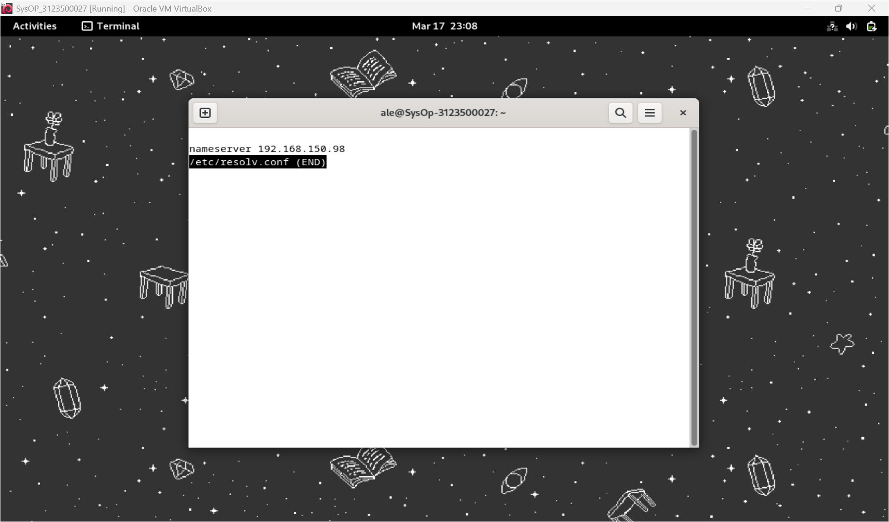</div>

### `nslookup`

Penjelasan:<br>
Perintah ini adalah utilitas untuk melakukan query DNS. Dapat digunakan untuk mendapatkan informasi seperti alamat IP berdasarkan nama domain atau sebaliknya. Salah satu fungsi command adalah untuk troubleshooting masalah DNS.
Percobaan:
<br><div style=width:500;>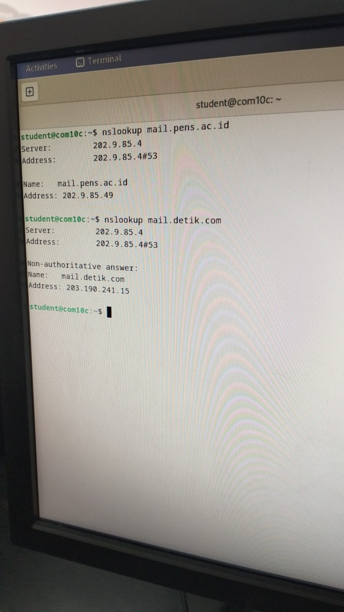</div>

### `less /usr/share/dns/root.hints`

Penjelasan:<br>
Membaca file `root.hints`, yang berisi daftar server root DNS. Informasi ini digunakan oleh resolver untuk memulai query ke server root jika diperlukan.
Percobaan:
<br><div style=width:500;>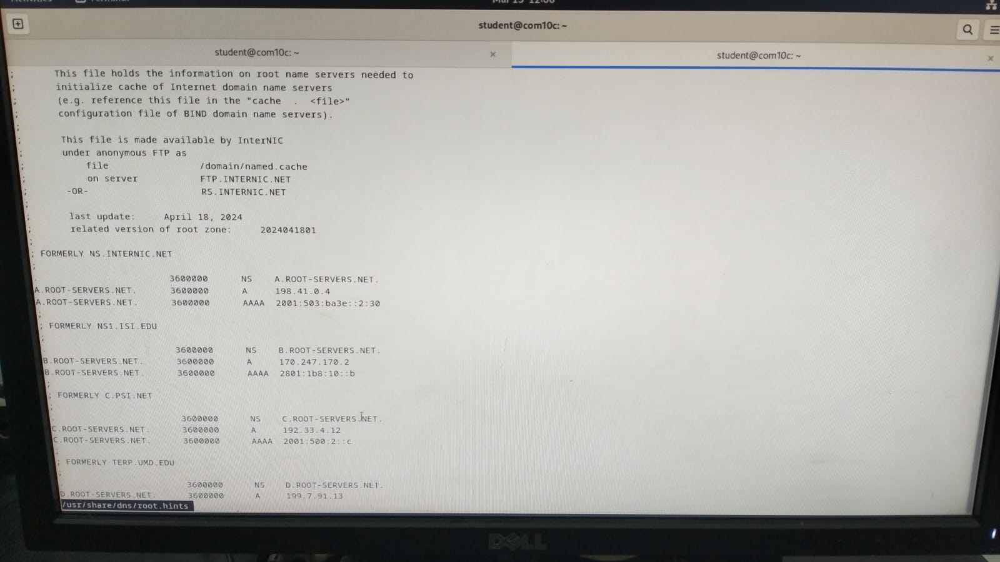</div>

## Ekosistem Internet

Internet berkembang pesat di seluruh dunia berkat tiga faktor utama, yaitu kepemilikan global bersama, pengembangan standar terbuka, serta proses pengembangan teknologi dan kebijakan yang dapat diakses secara bebas. Model internet yang terbuka, transparan, dan kolaboratif memungkinkan inovasi berkembang di berbagai wilayah dengan pendekatan bottom-up yang dapat diakses oleh semua pengguna.

### Internet

Internet dapat dipandang dari dua sisi, yaitu sisi teknis dan sisi arsitektur.

- sisi teknis:<br>
  internet terdiri dari sistem routing dan sistem penamaan, yang berfungsi untuk mengatur lalu lintas data serta mengelola identitas dalam jaringan.
- sisi arsitektur:<br> internet terdiri dari berbagai standar, penyedia layanan, registri internet, dan clearing houses yang memastikan kelancaran operasionalnya.

### IP Addressing & Routing System

Sistem alamat IP berfungsi sebagai identitas unik yang memungkinkan pengiriman data ke tujuan yang diinginkan. Routing menentukan jalur terbaik bagi data untuk mencapai tujuannya dengan efisien. Proses ini memastikan komunikasi antar perangkat dapat berjalan dengan optimal dalam jaringan internet yang luas.

### Routing

Internet terdiri dari jaringan overlay Autonomous Systems (AS) yang membentuk topologi virtual. Kebijakan routing yang diterapkan oleh setiap AS berbeda, tergantung pada tujuan bisnis dan operasionalnya. Beberapa penyedia layanan mengoptimalkan biaya dan pendapatan dengan menetapkan kebijakan routing tertentu yang lebih efisien.

### Peering Connections

Model peering dalam jaringan internet terdiri dari tiga jenis utama, yaitu Provider/Customer, Transit, dan Settlement Free. Peering bertujuan untuk mengurangi latensi serta menekan biaya transit data dengan memanfaatkan hubungan langsung antar penyedia layanan.

### Edge Provider Routing Policy

Penyedia layanan di sisi jaringan berusaha menarik sebanyak mungkin lalu lintas agar dapat meningkatkan efisiensi koneksi. Mereka menggunakan metode hot potato routing, yaitu teknik di mana data dikirim secepat mungkin ke jaringan lain untuk meminimalkan biaya operasional.

### Transit Provider Routing Policy

Transit provider bertanggung jawab atas pengelolaan lalu lintas jaringan antara penyedia layanan akses dan konten. Mereka menerapkan strategi seperti cold potato routing untuk mempertahankan kontrol lebih besar atas data yang mereka kelola, sehingga dapat mengoptimalkan pengalaman pengguna.

### Content Provider Routing Policy

Penyedia konten berusaha mendistribusikan data mereka sedekat mungkin ke pengguna untuk mengurangi latensi dan meningkatkan kecepatan akses. Untuk mencapai tujuan ini, mereka menggunakan mekanisme distribusi konten seperti Content Delivery Network (CDN), yang memungkinkan pengiriman data lebih cepat dan efisien.

### Naming System

Sistem penamaan dalam internet memungkinkan pengguna untuk mengakses situs web menggunakan nama domain yang lebih mudah diingat dibandingkan dengan alamat IP. Proses ini membuat navigasi di internet menjadi lebih sederhana dan ramah pengguna.

### Root Servers

DNS memiliki 13 root name servers yang tersebar di seluruh dunia untuk mengelola sistem penamaan global. Masing-masing root server memiliki beberapa instance yang didistribusikan menggunakan teknik anycast, sehingga dapat melayani permintaan dengan lebih cepat dan efisien.

### Standards Organizations

Standarisasi internet dikembangkan oleh berbagai organisasi seperti IETF, ICANN, dan IEEE. IETF atau Internet Engineering Task Force bertanggung jawab atas pengembangan berbagai protokol komunikasi, seperti TCP/IP, HTTP, dan DNS, yang menjadi dasar dari operasional internet saat ini.

### Internet Engineering Task Force (IETF)

IETF didirikan pada tahun 1986 sebagai organisasi yang berfokus pada pengembangan standar internet. Organisasi ini tidak memiliki keanggotaan formal, melainkan terbuka untuk partisipasi publik melalui milis dan pertemuan rutin. Semua keputusan dan pengembangan dilakukan secara transparan dengan kontribusi dari komunitas global.

### Service Providers

Penyedia layanan internet (ISP) bertugas menyediakan akses internet bagi individu maupun bisnis. Penyedia layanan ini terbagi ke dalam beberapa kategori, seperti Content Providers yang menyediakan konten digital, Access Providers yang memberikan akses jaringan kepada pengguna, dan Transit Providers yang menghubungkan penyedia akses dengan penyedia konten.

### Internet Exchange Point (IXP)

IXP adalah titik pertukaran internet yang memungkinkan penyedia layanan untuk saling terhubung secara langsung di tingkat lokal. Keberadaan IXP membantu mengurangi latensi serta menekan biaya interkoneksi dengan menggantikan sistem perhitungan lalu lintas berbasis biaya dengan model berbasis keanggotaan tetap.

### Registries

ICANN dan IANA bertanggung jawab dalam mengelola sistem penomoran dan penamaan internet. Selain itu, registri regional seperti APNIC dan RIPE berperan dalam mengalokasikan blok alamat IP kepada penyedia layanan di berbagai wilayah.

### Top Level Registries

Registri domain tingkat atas (TLD) bertanggung jawab atas pengelolaan domain seperti .com, .org, serta ccTLDs (Country Code TLDs) seperti .id untuk Indonesia. ICANN mengawasi pengelolaan TLD ini dan menetapkannya kepada berbagai registri resmi.

### Second Tier Registries

Registri tingkat kedua bertindak sebagai reseller yang menjual nama domain kepada pengguna akhir. Mereka dapat menentukan harga domain berdasarkan popularitas atau menggabungkannya dengan layanan lain untuk menarik lebih banyak pelanggan.

### Clearing Houses

Clearing houses berperan sebagai pusat koordinasi dalam berbagai kebijakan dan operasional jaringan internet. Lembaga ini membantu memastikan kelancaran komunikasi dan transaksi antara berbagai entitas dalam ekosistem internet.

### Internet Route Registries (IRR)

IRR adalah database kebijakan routing yang digunakan oleh penyedia layanan untuk memvalidasi rute jaringan. Data dalam IRR digunakan oleh banyak penyedia layanan untuk memastikan bahwa rute yang diiklankan melalui BGP telah terdaftar dalam basis data yang mereka percayai.

### Network Operators Groups (NOGs)

NOGs adalah komunitas operator jaringan yang bertindak sebagai clearing houses untuk berbagi informasi dan praktik terbaik dalam pengelolaan jaringan internet. Organisasi ini sering bekerja sama dengan registri regional, lembaga penelitian, serta vendor teknologi dalam meningkatkan efisiensi dan keamanan jaringan.

## Instalasi DNS Server

Langkah 1:<br>
Instalasi BIND menggunakan perintah `sudo apt -y install bind9 bind9utils`
<br>Percobaan:
<br><div style=width:500;>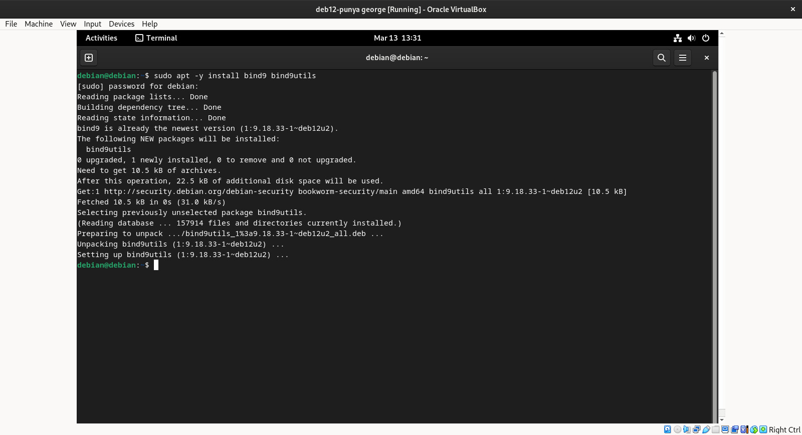</div>

Langkah 2:<br>
Konfigurasi BIND untuk network internal dalam named.conf menggunakan perintah `sudo nano /etc/bind/named.conf` untuk menambahkan `include "/etc/bind/named.conf.internal-zones";`
<br>Percobaan:
<br><div style=width:500;>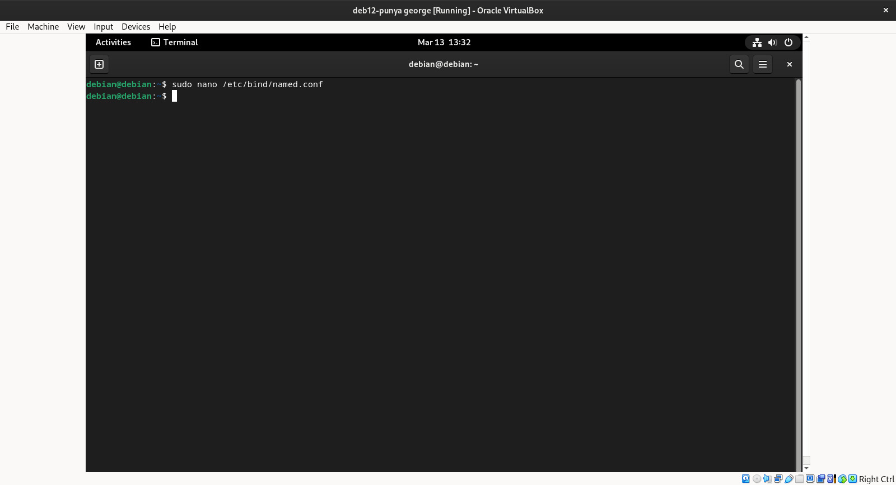</div>
<br><div style=width:500;>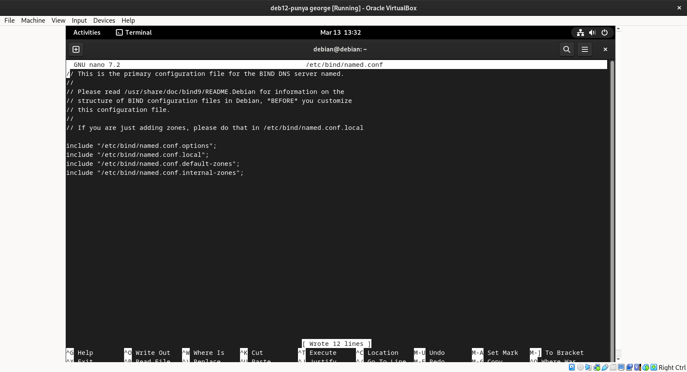</div>

Langkah 3:<br>
Konfigurasi BIND untuk network internal dalam named.conf.options menggunakan perintah `sudo nano /etc/bind/named.conf.options` untuk menambahkan:

```bash
        acl internal-network {
                10.0.0.0/24;
        };
...
...
        # add local network set on [acl] section above
        # network range you allow to recieve queries from hosts
        allow-query { localhost; internal-network; };
        # network range you allow to transfer zone files to clients
        # add secondary DNS servers if it exist
        allow-transfer { localhost; };
        # add : allow recursion
        recursion yes;
```

Percobaan:
<br><div style=width:500;></div>
<br><div style=width:500;>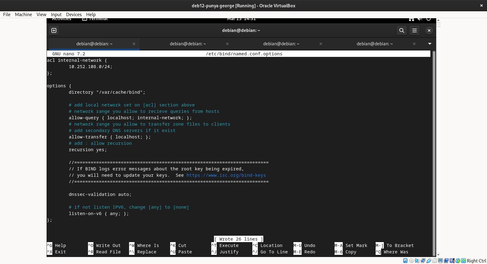</div>

Langkah 4:<br>
Konfigurasi BIND untuk network internal dalam named.conf.internal-zones menggunakan perintah `sudo nano /etc/bind/named.conf.options` untuk menambahkan:<br>

```bash
zone "kelompok6.home" IN {
        type master;
        file "/etc/bind/kelompok6.home.lan";
        allow-update { none; };
};
zone "108.252.10.in-addr.arpa" IN {
        type master;
        file "/etc/bind/108.252.10.db";
        allow-update { none; };
};
```

Percobaan:
<br><div style=width:500;>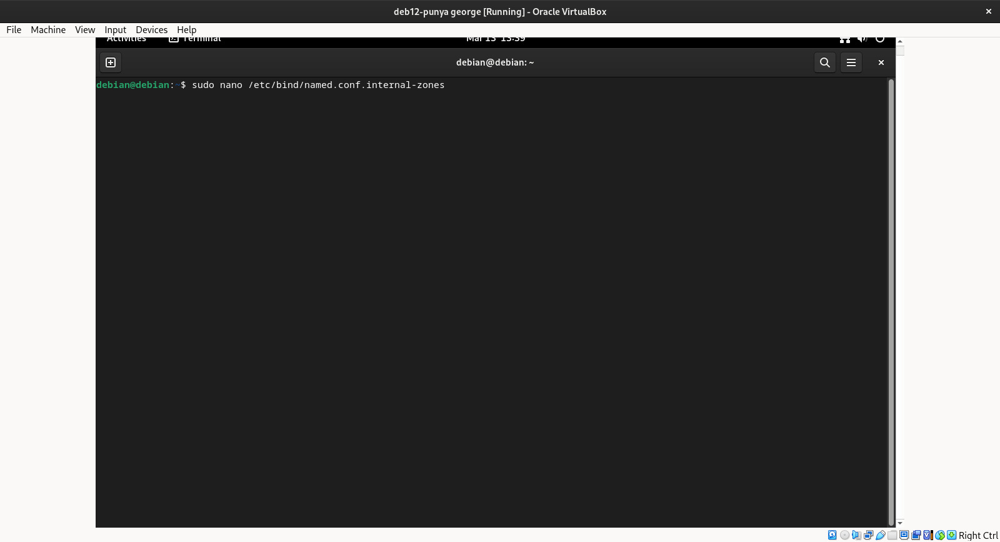</div>
<br><div style=width:500;>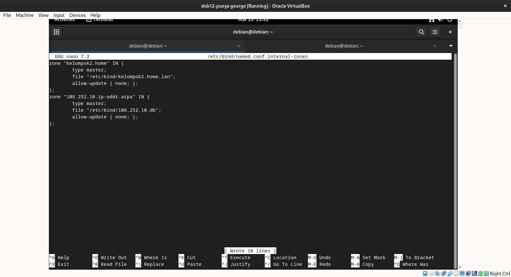</div>

Langkah 5:<br>
Konfigurasi BIND untuk network internal dalam /default/named menggunakan perintah `sudo nano /etc/default/named` untuk menambahkan:<br>

```bash
# add
OPTIONS="-u bind -4"
```

Percobaan:
<br><div style=width:500;>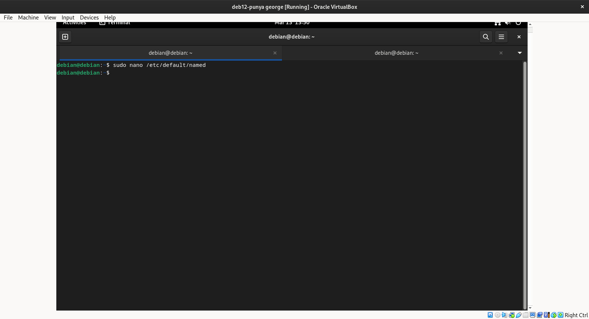</div>
<br><div style=width:500;></div>

Langkah 6:<br>
Membuat file zona yang digunakan server untuk menyelesaikan alamat IP dari nama domain, menggunakan perintah `sudo nano /etc/bind/kelompok6.home.lan`
<br>Percobaan:
<br><div style=width:500;>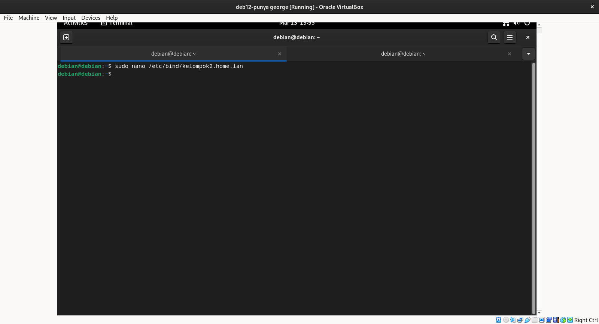</div>
<br><div style=width:500;>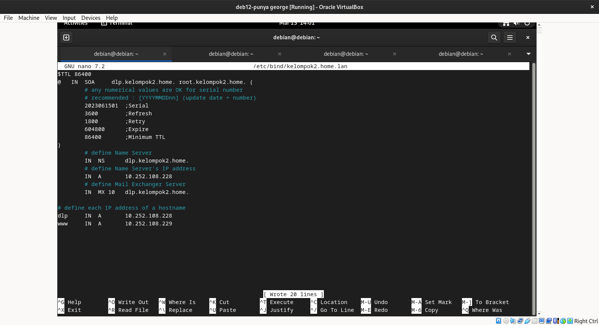</div>

Langkah 7:<br>
Buat file zona yang memungkinkan server mengubah nama domain menjadi alamat IP menggunakan perintah `sudo nano /etc/bind/108.252.10.db`
<br>Percobaan:
<br><div style=width:500;></div>
<br><div style=width:500;></div>

Langkah 8:<br>
Restart BIND untuk menyimpan perubahan menggunakan `systemctl restart named`
<br>Percobaan:
<br><div style=width:500;></div>

Langkah 9:<br>
Merubah pengaturan DNS untuk merujuk ke DNS sendiri pada resolv.conf
<br>Percobaan:
<br><div style=width:500;>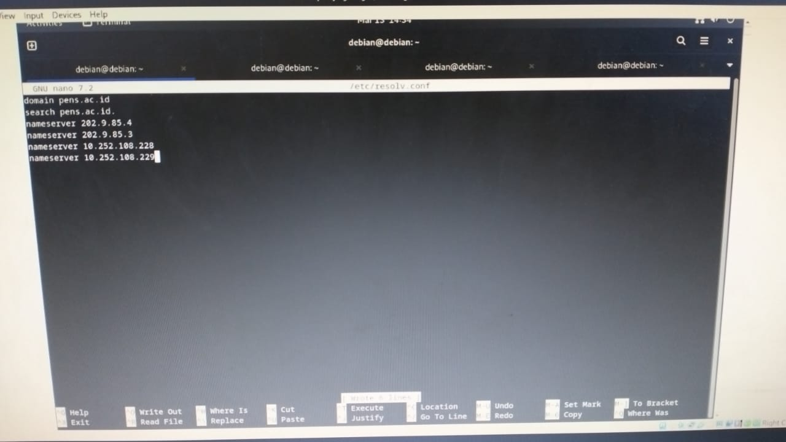</div>

Langkah 10:<br>
Verifikasi Resolusi Nama dan Alamat menggunakan `dig dlp.kelompok6.home.` dan `dig -x 10.252.108.228`
<br>Percobaan:
<br><div style=width:500;>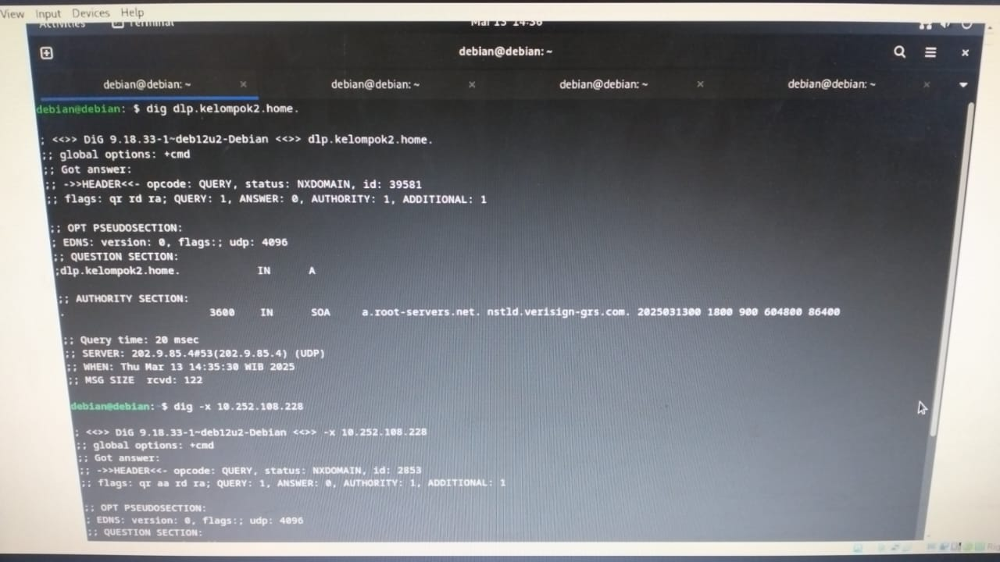</div>
<br><div style=width:500;>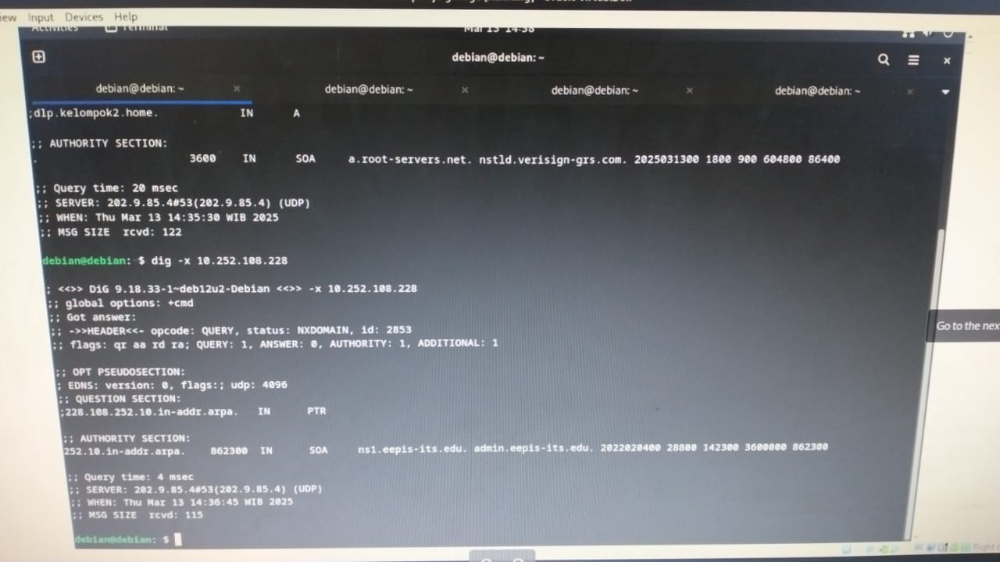</div>
